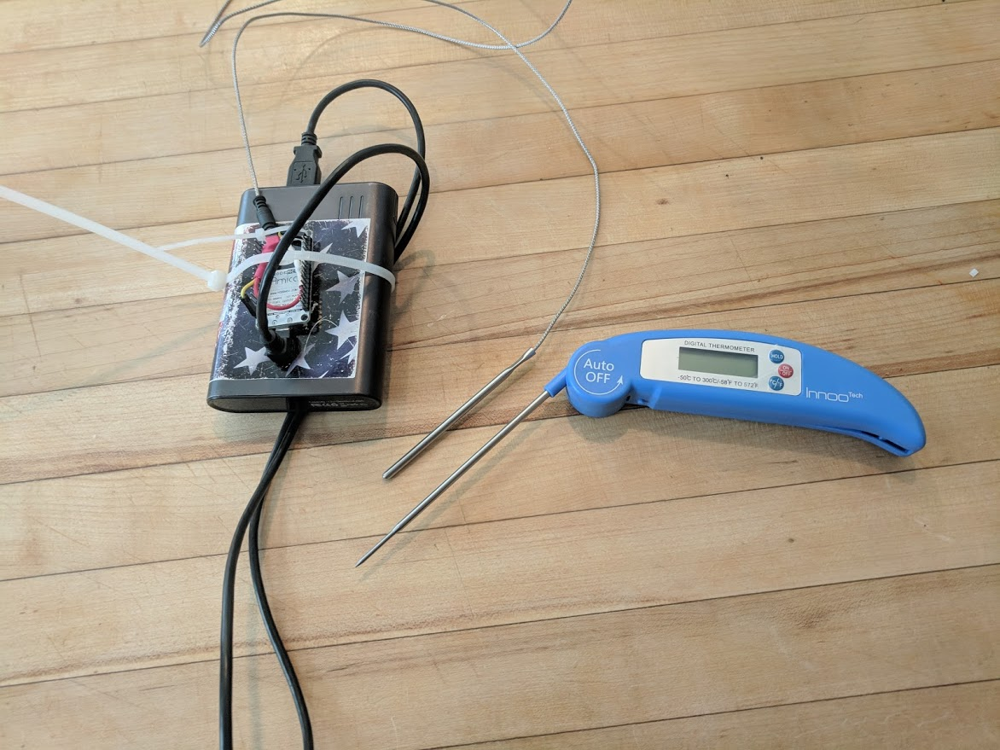
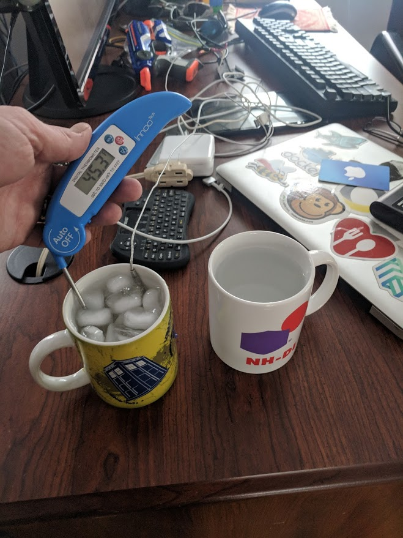
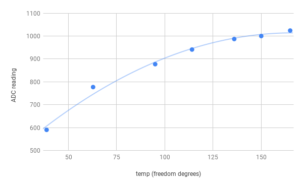

# BBQ temperature from esp8266
> remote monitoring of cooking temperatures

## 2018 thanksgiving
My iGrill device (blue tooth connected thermometer) failed the morning I wanted to smoke a turkey so I hooked the thermistor to an esp8266 ADC pin and got it reporting temperature over mqtt so I could monitor temperature without having to open the grill.

I was also working on esp8266 controlled Xmas lights at the time so I had the temperature displayed on the front of the house.

## Device
USB power pack with esp8366 wire tired to it next to my thermapen

Turkey + probes + grill + thermapen for calibration

Trying to get an idea for how the probe responds to different temperatures. Ice water on the left, hot tap water on the right.

I did some more calibration with a pot of hot water on the stove top to see where the 165d target range would report.

Some rough calibration graphing

## Future

### Multiple probes
I verified I can use the many GPIO pins in conjunction with the single ADC pin to alternately power multiple probes.
* Multiple meat temperatures
* Rack temperature (aka Pit temperature)
* Outside temperature (why not - super easy to add another probe)
* Vibration (aka watched pot sensor)

### Standalone Web Server and Access Point
The esp8266 can be an access point and host a web server. Develop a java script app to allow the device to operate remotely w/o WiFi access - or allow configuration of WiFi access to something like a cellphone hot spot.
Graphs, complex control, social media publishing etc possible with this.

### 3D printed case
The device is pretty fragile with just wire ties and it would be pretty easy to display the temperature or at least a health check/status with some LEDs.
