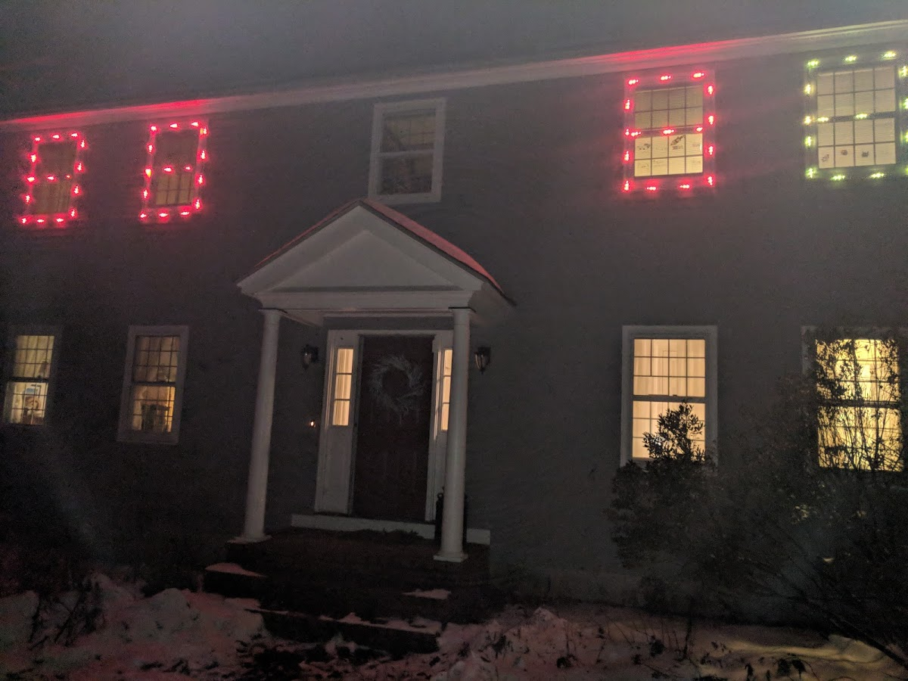
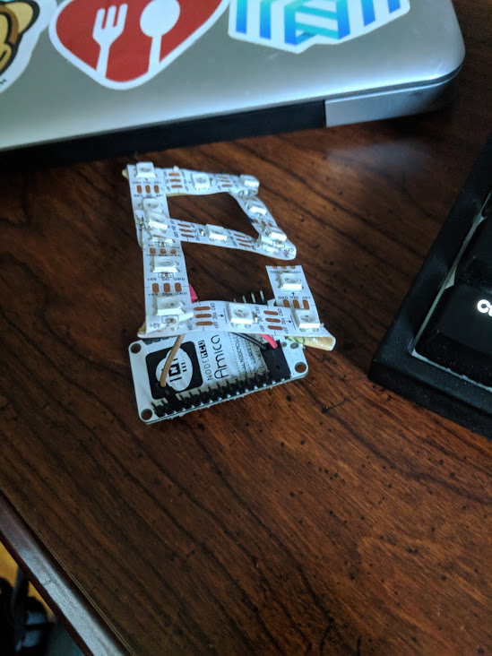
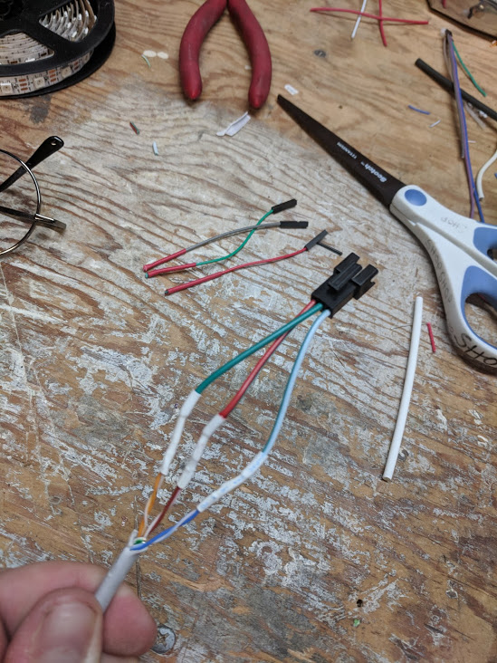

# xmas lights
> esp8266 controlled xmas lights



## Technologies used
* [esp8266](https://www.esp8266.com/wiki/doku.php?id=getting-started-with-the-esp8266)
* [ws2812b LED strips](https://www.google.com/search?q=ws2812b&source=univ&tbm=shop&tbo=u&sa=X&ved=0ahUKEwi5883CsfLeAhWjxVkKHTRFBToQsxgILQ&biw=1333&bih=1221)
* [micropython](https://micropython.org/)
* [mqtt](http://mqtt.org/)

A seven segment prototype hooked to the esp8266


Using 10baseT wire to connect indoor esp8266 to outdoor 2s2821b


Flash esp8266 with micropython
```
sudo /home/matt/.local/bin/esptool.py --port /dev/ttyUSB0 erase_flash
sudo /home/matt/.local/bin/esptool.py --port /dev/ttyUSB0 --baud 460800 write_flash --flash_size=detect 0 ~/Downloads/esp8266-20190529-v1.11.bin 
sudo picocom /dev/ttyUSB0 -b115200
```

Connect the esp8266 to the wifi
```
import network
w = network.WLAN(network.STA_IF)
w.active(True)
w.connect('ShArVa', 'pw-redacted')
w.isconnected()
w.ifconfig()
```

Enable wifi based webrepl to upload new code
```
import webrepl_setup
```

Push new code over USB connection
```
ampy put main.py; sudo picocom /dev/ttyUSB0 -b115200
ampy -p /dev/ttyUSB0 -b 115200 put main.py; sudo picocom /dev/ttyUSB0 -b115200
```
## journal
### 2019-09-17
Blue smoke. Fuck.

### 2019-09-24
Last night sucked... today started with yet another new problem. Every component in this stack is failing - hardware and software

Masterbedroom west strip won't light... tested circut J on coiled strip and it works
This strip was working last night and I didn't make physical changes last night so I dunno how I could have damaged it

Suspect the desoldering attempts messed up the voltage adjuster... new chop looks good... 

9:09pm
Hooking up window unit... must've swapped pox/neg on power in... melted wire...

Resoldered wire on unit E
3 windows party time. VICTORY

### 2019-09-25
Devices all returning "Sleep" status
Sent "Party" command, but once again master east is slow to resond

Inventory is becoming problematic - swapped the master east to diagnose possible wifi problems and missed getting it's esp_id into send.sh

Goal: Rewrite `sleep` to operate on clock and check for msg more often... but not TOO often

### 2019-09-26
Worked from home all day and it was hard not to THINK about the inventory problem
Once 5pm rolled around I wasn't motivated to solve it

### 2019-09-27
Inventory = Just put it in the make file comments... <10 devices shouldn't be that hard to track
Had wrong IP for device H and really didn't want to cut it from the window and check it
Thought about using mac laptop to get it, but USBC -> FUCK doesn't work
Looked up IP's in the router, and was able to map the mac address ESP_4A52D7 to the device ID esp8266_d7524a00

Devices G and K didn't have the 3v->5v jumper wire. Bad quality solder M@

Installed Nick's windows... working pretty well

Got block setup more safe... declaring it location 0

Version 1.0.0 launched
```
Time: 2019-09-27 21:10:31.898417
desk window     0.22.0:reset    just now
esp8266_88524a00        0.22.0:hello: sleep     a minute ago
Master West     0.22.0:hello: sleep     just now
breadboard      1.0.0:hello: sleep      17 seconds ago
Master East     0.22.0:hello: sleep     18 seconds ago
Master East not 0.22.0:hello: sleep     a minute ago
```
### 2019-09-28
Starting time_calibration stuff
Units 1 and 5 needed reset
Reset all - now unit 4 is not behaving - showing party pixels vs. time calibration

Unit 1 software not updating... might have wrong IP for it - maybe not... Nope - it's right. Published to it and confirmed. Turn around on pub/msg is a pain

Time calibration sends lots of messages... maybe overloading MQTT bus?

4 & 5 being little bitches now... not reporting...

Can publish to 4... but it's not sending MQTT

Added `sleep 1` between repyl pub of main.py and config.py - did it before, removed it, just put it back... publish worked 100%

Status
0: Champ
1: Reporting OK, but no lights... probably loose connector
2: Champ
4: first light seems to be blinking with time_calibration... others in party mode
5: can publish... but sketchy replies
6: Champ

### 2019-09-29

Stats
0: Champ
1:
2:
4:

### 2019-09-30
Stats
0: Champ
1: Champ
2: Impish
4: Impish
5: Champ
6: Impish

Hard reset fleet and all reporting for a bit... then sadness

### 2019-10-02
States
0: Impish
1: Champ
2: Champ
4: Champ
5: Champ

9:25pm All working
Encountered problem with device 4 where only one pixel was responding.
Disconnected neopixels from device and back again and it started working

Device 5 might have crashed... webrepl connection worked to machine.reset()

And just when it looks like everythings working... the MUTHER FUCKING USB SHIT PROBLEM AGAIN
(This is all coupled with Nick having Occulus USB3.0 problems on his machine... FML)

### 2019-10-03
USB still fucked

Devices 1 and 4 reporting but no lights - a new kind of hell
Device 0 (USB powered) not booting

USB non 3.0 ports working OK... plugged into USB hub and can work on things now

Units 1 and 4 are reporting, but no lights. Maybe start rotating devices... or power supplies?

### 2019-10-05
Messing around with home assistant on the pi running MQTT broker and it seems to have broken everything
The MQTT broker went down and maybe crashed everyone? Should probably test that.

Rebooted device 0

Currently 
0: Champ
1: impish
2: impish
4: impish
5: impish (but solid red for some reason)
6: impish

USB got fucked... turned the port off/on on the hub and it recovered... nope it's fucked
Another new behaviour = the USB port shows up but I can't connect
```bash
$ ls /dev/ttyU*
/dev/ttyUSB0

$ picocom /dev/ttyUSB0 -b115200
picocom v2.2
...
FATAL: cannot open /dev/ttyUSB0: Input/output error
```
Tried a different cable - things work. Sigh.

### 2019-11-06
Took some time off from the project.
Found a couple articles detailing problems with MQTT and sketch wifi. Fits with the problems I'm having with the more remote devices.

Spun up a new version of main.py with NO mqtt and launched it in the morning.
Morning -> thru evening:
0: champ
1: dead
2: champ
3: dead
4: looks like it started disco and froze
6: champ

### 2019-11-07
Most devices IP addresses seem to have changed
Had to reflash 5: device K

Using python http.server (simply http) to control
And - it hangs... not too kewl

8:38pm - things working very well
Running webserver on desktop and devices expect it to be there
```bash
matt@mattdesktop:~/git/minions/esp8266/strip/server$ python3 -m http.server
```


